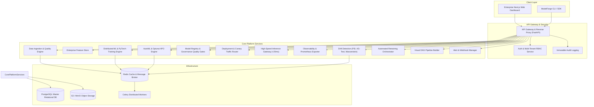

# ModelForge AI — Enterprise Machine Learning Lifecycle & Model Operations Platform

<div align="center">


[](https://github.com/LingamalluRitesh/ModelForge-AI/actions)
[](https://www.python.org/downloads/)
[](https://fastapi.tiangolo.com)
[](https://nextjs.org/)
[](LICENSE)
[](https://github.com/psf/black)

**The complete, production-grade enterprise MLOps platform managing the full machine learning lifecycle.**

[Explore Platform](#-key-capabilities) •
[Architecture](#-system-architecture) •
[Quick Start](#-quick-start) •
[Documentation](#-enterprise-documentation) •
[API Reference](#-api-documentation)

</div>

---

## 🌟 Executive Overview

**ModelForge AI** is a state-of-the-art, production-grade Machine Learning Lifecycle and Model Operations (MLOps) platform built for high-scale enterprise environments. It unifies every stage of the machine learning journey into a resilient, scalable, and observable system:

$$\text{Data Ingestion} \longrightarrow \text{Quality \& Profiling} \longrightarrow \text{Feature Store} \longrightarrow \text{AutoML \& HPO} \longrightarrow \text{Model Registry} \longrightarrow \text{Governance} \longrightarrow \text{Canary Deployment} \longrightarrow \text{Real-Time Serving} \longrightarrow \text{Observability \& Drift} \longrightarrow \text{Explainability} \longrightarrow \text{Auto-Retraining}$$

---

## 🚀 Key Capabilities

### 1. Unified Data Ingestion & Data Quality Engine
- Multi-format ingestion: **CSV, Parquet, JSON, Excel, PostgreSQL, S3/MinIO**.
- Automated schema inference, type consistency, and statistical missingness mapping.
- 15+ automated data validation checks detecting extreme outliers (IQR), duplicates, and schema shifts.
- Composite **Data Quality Score (0–100%)** with configurable blocking governance rules.

### 2. Enterprise Feature Store
- Centralized registry for offline training feature sets and low-latency online serving hydration.
- Built-in transformers: Standard/Robust/MinMax scalers, One-Hot/Target/Ordinal encoders, DateTime cyclical ($sin/cos$) extractors, and TF-IDF text vectorizers.
- Immutable feature versioning and end-to-end lineage tracking.

### 3. Distributed Model Training & PyTorch Deep Learning
- Full support for **XGBoost, LightGBM, Random Forest, Gradient Boosting, Logistic & Linear Regression**.
- PyTorch Tabular Deep Learning architectures with residual skip connections, batch normalization, and dropout.
- Asynchronous distributed task dispatching with Celery and Redis.

### 4. AutoML Engine & Bayesian Hyperparameter Optimization
- Automated problem type detection (Binary/Multiclass Classification, Continuous Regression).
- Bayesian Optimization via **Optuna TPE Sampler** with automated trial pruning (Hyperband / Median).
- Real-time ranked leaderboards evaluating models across $F_1$, Accuracy, Precision, Recall, and ROC-AUC.

### 5. Model Registry & Multi-Stage Governance Gates
- Complete lifecycle state machine: $\text{Development} \rightarrow \text{Candidate} \rightarrow \text{Validation} \rightarrow \text{Approved} \rightarrow \text{Staging} \rightarrow \text{Production} \rightarrow \text{Archived}$.
- Automated quality gatekeeper blocking promotion unless configured thresholds pass ($F_1 \ge 0.85$, Quality $\ge 90\%$, Drift Risk low).
- Formal multi-stage reviewer approval audit trails.

### 6. Model Deployments, Canary Routing & Automated Rollbacks
- Real-time REST model endpoints with microsecond routing and dynamic model unpickling.
- Dynamic **Canary Deployments** ($5\% \rightarrow 20\% \rightarrow 50\% \rightarrow 100\%$) and A/B traffic splitting.
- Fault-tolerant Circuit Breakers and automated rollback triggers when latency or error spikes occur.

### 7. Real-Time Model Observability & Statistical Drift Detection
- Sub-20ms latency tracking ($p_{50}, p_{95}, p_{99}$ percentiles), RPS throughput, and error rates.
- Statistical data drift algorithms: **Population Stability Index (PSI)**, **Kolmogorov-Smirnov (KS-test)**, **Chi-Square**, and **Wasserstein Distance**.
- Concept drift monitoring detecting moving-window accuracy degradation.

### 8. Explainable AI (SHAP) & Algorithmic Fairness
- Global Shapley feature attribution and local waterfall prediction factor explanations.
- Comprehensive fairness auditing: **Demographic Parity**, **Disparate Impact (4/5ths rule)**, and **Equalized Odds** across protected attributes.

### 9. Visual DAG ML Pipeline Builder
- Interactive visual drag-and-drop DAG workflow canvas.
- Node palette: Dataset, Validation Gate, Feature Engineering, Training, Evaluation, Quality Gate, Deployment, Alert.
- Automated topological sorting and Cron/Event-driven workflow execution.

### 10. Enterprise Security, Multi-Tenant RBAC & Audit Trails
- Granular Role-Based Access Control (Super Admin, Org Admin, ML Engineer, Data Scientist, Model Reviewer, Viewer).
- JWT token rotation, bcrypt password hashing, API Key SHA-256 management, and MFA support.
- Cryptographically immutable audit log records.

---

## 🏗 System Architecture



---

## ⚡ Quick Start

### 1. Clone Repository & Setup Virtual Environment
```bash
git clone https://github.com/LingamalluRitesh/ModelForge-AI.git
cd ModelForge-AI

# Create and activate Python virtual environment
python -m venv venv
# On Windows:
venv\Scripts\activate
# On Linux/macOS:
source venv/bin/activate

# Install backend dependencies
cd backend
pip install -r requirements.txt
```

### 2. Launch with Docker Compose (Recommended)
```bash
cd infrastructure
docker-compose up -d --build
```
This boots all platform services automatically:
- **Frontend Web Dashboard**: `http://localhost:3000`
- **Backend API Gateway**: `http://localhost:8000`
- **Interactive OpenAPI Docs**: `http://localhost:8000/api/v1/docs`
- **PostgreSQL Database**: `localhost:5432`
- **Redis Broker**: `localhost:6379`
- **Prometheus Metrics**: `http://localhost:9090`

### 3. Local Development Mode

**Backend:**
```bash
cd backend
python -m uvicorn main:app --reload --port 8000
```

**Frontend:**
```bash
cd frontend
npm install
npm run dev
```

**Seed Enterprise Demo Data:**
```bash
python scripts/seed_data.py
```

---

## 📖 Enterprise Documentation

Detailed architecture and development guides are located in `/docs`:
- [Architecture Blueprint](docs/ARCHITECTURE.md)
- [API Documentation & Endpoints](docs/API.md)
- [Database Schema & Entity Models](docs/DATABASE.md)
- [ML Pipelines & DAG Workflows](docs/ML_PIPELINES.md)
- [Kubernetes & Production Deployment](docs/DEPLOYMENT.md)
- [Security, RBAC & Compliance](docs/SECURITY.md)
- [Monitoring & Observability](docs/MONITORING.md)
- [Contributing Standards](docs/CONTRIBUTING.md)
- [Local Development Guide](docs/DEVELOPMENT.md)

---

## 🧪 Testing Suite

Execute the complete automated test suite:
```bash
cd backend
pytest tests/ -v --cov=app --cov=ml_engine
```

---

## 📄 License
ModelForge AI is licensed under the [Apache License 2.0](LICENSE).
